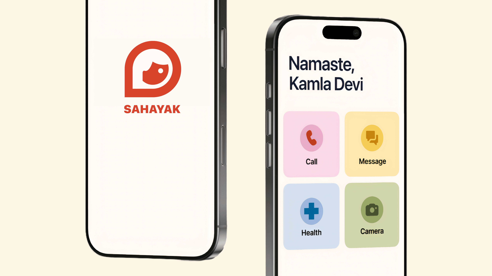

# Sahayak

View Full Prototype on Figma [▶️](https://bit.ly/sahayak_app) 

---

## Just in Case
Imagine a phone that understands you—no more squinting to read tiny text or fumbling through endless menus. Sahayak uses clear, natural voice prompts and big, touch‑friendly controls to help you make and answer calls, send and hear messages, and manage contacts without hassle. Whether you’re more comfortable speaking in Hindi, English, or another language, Sahayak listens and responds, guiding you step by step. In an emergency, one‑tap access to your loved ones or medical services gives you and your family real peace of mind—and if you ever have a fall, Sahayak can send an alert for help. It’s technology designed to feel like a trusted friend, empowering you to stay connected, safe, and independent every day.

---

## Contributors
Aastha: [@aastha1708](https://github.com/aastha1708)  
Amrut: [@amrutmuj](https://github.com/amrutmuj)  
Sandeep: [@sandeep21358](https://github.com/sandeep21358)  
Suvrat: [@NegativeMan21](https://github.com/NegativeMan21)  

---

## 📝 Project Overview
Sahayak is a smartphone companion app crafted for seniors, people with low vision, and their caregivers. By replacing cluttered menus with large, intuitive buttons and natural voice commands (in Hindi, English, and regional languages), it empowers users to stay connected and safe—while giving caregivers the visibility and peace of mind they need.

**Goals:**
1. **Empower Independence** – Seamless calling, messaging, and contact management.  
2. **Enhance Safety** – Fall detection, health reminders, and one‑touch emergency calls.  
3. **Support Caregivers** – Remote monitoring of schedules, logs, and alerts.

---

## ✨ Features
- **Voice‑First Interaction**  
  Multilingual voice recognition for hands‑free calling, messaging, and data entry.

- **One‑Touch Emergency**  
  Instant call/SMS to family, friends, or medical services with a single tap.

- **Automatic Fall Detection**  
  Sensors detect a hard fall and dispatch alerts automatically.

- **Health Reminders & Logs**  
  Medication schedules, appointment notifications, and vitals tracking.

- **Simplified Messaging & Calling**  
  Large text, photo thumbnails, read‑aloud messages, and quick‑reply buttons.

- **Customizable Contacts**  
  Add/edit via text or speech; assign profile photos with the built‑in camera.

---

## 🎨 User Interface
1. **Home Screen**  
   Four large tiles for Calls, Messages, Health, and Emergency.

2. **Contacts List**  
   Oversized avatars labeled “Daughter,” “Doctor,” etc., with a “Favorite” section.

3. **Dialer & Keyboard**  
   Well‑spaced keys, big numbers, and a voice‑dictation toggle.

4. **Photo Capture & Gallery**  
   Simple camera interface for contact photos and easy gallery browsing.

5. **Message View**  
   Read‑aloud chat bubbles, emoji picker, and one‑tap reply options.

6. **Health Dashboard**  
   Timeline of reminders, logs, and fall‑alert history in a clean, scrollable view.

---

> 🚀 **Explore the interactive designs** on Figma:  
> https://www.figma.com/community/file/1500164113743315782
